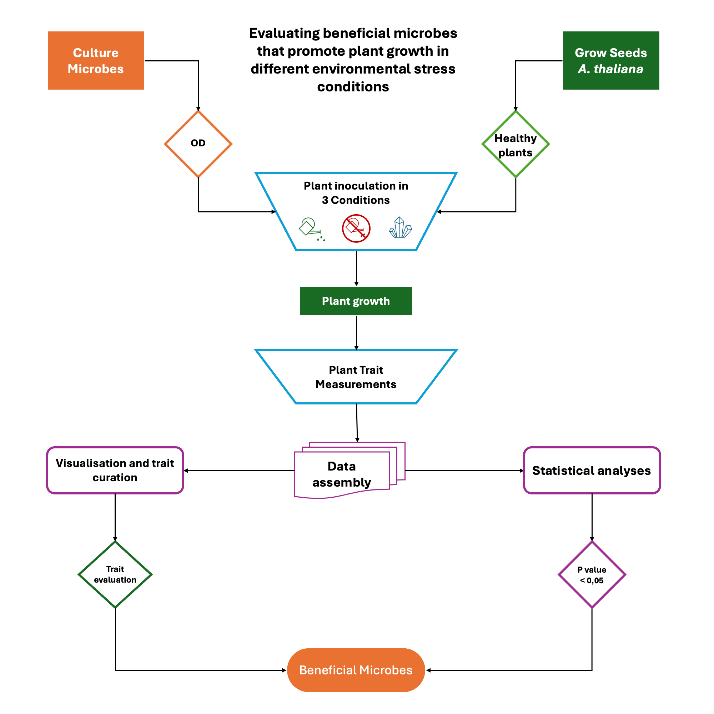

# Biosolutions

Sustainable solutions to address the effects of Climate Change on
induction of crop tolerance to biotic and abiotic stresses.

## Aims

* The identification of beneficial microbes from our "Biobank", which display plant-promoting properties
growth in at least one of the following conditions: extreme salinity, prolonged drought,
infection by a phytopathogen.
* The study of the compatibility of OEMs with the aforementioned properties, in order to create
synthetic microbial community with the combinatorial properties of its members.
* The control of the properties of the synthetic microbial community in bioassays on model plants.
* The complete sequencing of the genome of the strains with the desired properties.
* Identify the genomic regions responsible for these properties.
* The communication and dissemination of the results and conclusions of the project with the scientific community
community, wider society as well as with the private sector.

## Experiment design

How many microbes in each condition? 

How many plants?

